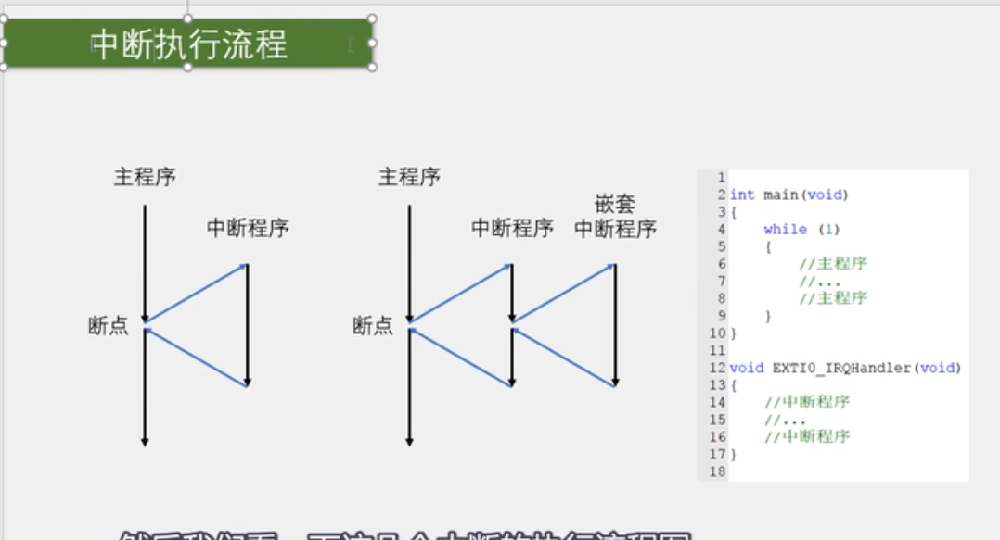
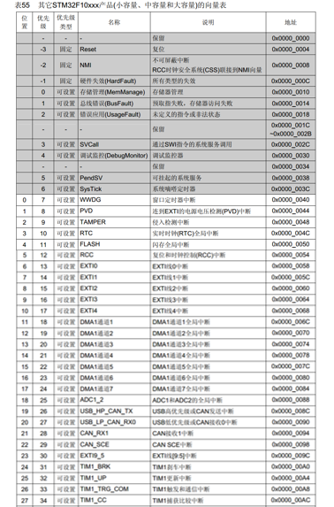
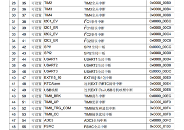
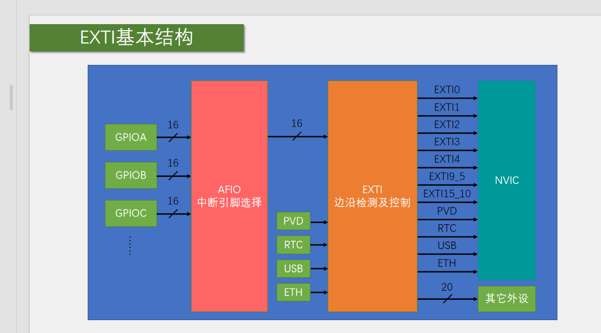

# 中断系统 
* EXTI 连接步骤






**STM32 AFIO（Alternate Function I/O，复用功能 I/O）详解**

AFIO 是 STM32 微控制器中的一个重要外设模块，主要用于 GPIO 复用功能配置 和 中断引脚映射。它允许开发者灵活地分配外设（如 USART、SPI、定时器等）到特定的 GPIO 引脚，并管理某些高级功能（如外部中断线选择、重映射等）。

---

**AFIO 的核心功能**
| 功能                     | 说明                                                                 |
|--------------------------|--------------------------------------------------------------------|
| 引脚复用配置          | 将外设（如 USART1、SPI1、TIM2 等）映射到指定的 GPIO 引脚。            |
| 引脚重映射（Remap）   | 某些外设的默认引脚可能不够用，AFIO 允许将它们重映射到其他备用引脚。      |
| 外部中断线配置        | 选择哪个 GPIO 引脚连接到 EXTI（外部中断）线（如 EXTI0 可接 PA0/PB0/...）。 |
| 事件输出控制          | 配置某些事件（如定时器捕获）输出到特定引脚。                           |
| 调试引脚复用          | 在调试模式下管理 SWJ（Serial Wire and JTAG）引脚的使用（如禁用 JTAG 释放 PA15/PB3）。 |


** 注意事项**
1. 时钟必须使能  
   使用 AFIO 前，必须先开启其时钟：
   ```c
   RCC_APB2PeriphClockCmd(RCC_APB2Periph_AFIO, ENABLE);
   ```
2. 重映射冲突  
   某些重映射选项是互斥的（如 TIM1 和 JTAG 引脚），需查阅数据手册。
3. CubeMX 自动配置  
   使用 STM32CubeMX 时，AFIO 的配置会自动生成，无需手动操作。

---

**总结**
• AFIO 是 STM32 的“引脚路由器”，管理外设复用、重映射和 EXTI 连接。

• 关键应用：

  • 重映射外设引脚（如 USART、SPI）。

  • 配置外部中断（EXTI）的 GPIO 来源。

  • 释放调试接口占用的引脚。

• 开发建议：优先使用 CubeMX 配置 AFIO，减少手动操作错误。


# STM32 NVIC 详解
NVIC（Nested Vectored Interrupt Controller，嵌套向量中断控制器）是 ARM Cortex-M 内核（包括 STM32）中管理中断的核心模块，负责处理所有外设中断的优先级、使能和响应。

---

**NVIC 的核心功能**
| 功能                | 说明                                                                 |
|---------------------|--------------------------------------------------------------------|
| 中断优先级管理   | 支持多级优先级（如 STM32 通常为 4-8 位，可配置 16-256 级优先级）。       |
| 中断嵌套        | 高优先级中断可打断低优先级中断，实现实时响应。                           |
| 自动保存上下文   | 进入中断时自动保存寄存器状态，退出时恢复，减少开发者负担。                |
| 向量表跳转       | 通过固定地址的向量表快速定位中断服务函数（ISR）。                        |

---

**总结**
• NVIC 是 STM32 中断系统的核心，负责优先级管理、嵌套和快速响应。  

• 开发时需关注：优先级分组、中断使能、ISR 编写。  

• 工具支持：STM32CubeMX 可自动生成 NVIC 配置代码，大幅简化流程。  

通过合理配置 NVIC，可以确保关键中断（如定时器、通信接口）得到实时处理，提升系统可靠性。


# EXTI_Trigger 在STM32库函数中，`EXTITrigger_TypeDef`枚举定义了外部中断（EXTI）的触发方式，即中断信号的有效边沿。以下是三种触发类型的详细解释：

---

**1. `EXTI_Trigger_Rising`（上升沿触发）**
• 值：`0x08`  

• 含义：当外部中断引脚的电平从 低电平（0）变为高电平（1）（即上升沿）时，触发中断。  

• 典型应用：  

  • 检测按键松开（假设按键按下为低电平，松开后恢复高电平）。  

  • 捕获脉冲信号的上升沿（如PWM信号起始）。


---

**2. `EXTI_Trigger_Falling`（下降沿触发）**
• 值：`0x0C`  

• 含义：当外部中断引脚的电平从 高电平（1）变为低电平（0）（即下降沿）时，触发中断。  

• 典型应用：  

  • 检测按键按下（假设按键按下时为低电平）。  

  • 捕获突发信号的下降沿（如故障信号）。


---

**3. `EXTI_Trigger_Rising_Falling`（双边沿触发）**
• 值：`0x10`  

• 含义：上升沿和下降沿均触发中断，即引脚电平发生任何变化（高→低 或 低→高）都会触发。  

• 典型应用：  

  • 需要同时检测电平双向变化的场景（如编码器信号、高频脉冲计数）。  

  • 调试时监控信号抖动。


# 终极总结：什么是抢占优先级 vs 子优先级 
* NVIC_PriorityGroupConfig
---

**1. 4位优先级值的本质**
• 二进制范围：`0000` ~ `1111`（十进制0~15）。  

• 分组规则（以`NVIC_PriorityGroup_2`为例）：  

  • 高2位（左边2位）：抢占优先级（Preemption Priority）  

  • 低2位（右边2位）：子优先级（Subpriority）  


示例：优先级值=`5`（二进制 `0101`）  
```
  二进制： 0 1 0 1
           │ │ │ │
           │ │ └─└─ 子优先级 = `01`（十进制1）
           └─└───── 抢占优先级 = `01`（十进制1）
```

---

**2. 关键规则**
1. 数值越小，优先级越高（无论是抢占还是子优先级）：  
   • 抢占优先级：`00`（0） > `01`（1） > `10`（2） > `11`（3）  

   • 子优先级：`00`（0） > `01`（1） > `10`（2） > `11`（3）  


2. 抢占优先级的核心作用：  
   • 高抢占优先级的中断可以打断低抢占优先级的中断（嵌套）。  

   • *示例*：抢占=0的中断可以打断抢占=1的中断，但不会打断另一个抢占=0的中断。  


3. 子优先级的核心作用：  
   • 仅当抢占优先级相同时，子优先级高的先执行（不嵌套，仅决定顺序）。  

   • *示例*：两个抢占=1的中断同时到来，子优先级=0的比子优先级=1的先执行。  


---

**3. 实际场景验证**
**配置三个中断**：
| 中断   | 抢占优先级 | 子优先级 | 实际优先级值（二进制/十进制） |
|--------|------------|----------|-------------------------------|
| 中断A  | 1          | 0        | `0100`（4）                   |
| 中断B  | 1          | 2        | `0110`（6）                   |
| 中断C  | 0          | 1        | `0001`（1）                   |

**执行逻辑**：
1. 中断C（抢占=0）可以打断中断A/B（抢占=1），因为抢占优先级更高（0 < 1）。  
2. 中断A和中断B抢占相同（=1），但中断A的子优先级更高（0 < 2），所以A先执行。  

---

**4. 常见问题解答**
**Q1：为什么“数值越小优先级越高”？**  
• 这是STM32硬件设计的规则（与日常习惯相反），目的是简化硬件比较逻辑。  

• 硬件行为：直接比较4位二进制值，数值小的优先级高。  


**Q2：如果抢占和子优先级都相同怎么办？**  
• 由硬件中断编号（IRQn）决定，编号小的优先（参考芯片手册的“中断向量表”）。  


**Q3：如何选择抢占和子优先级的位数？**  
• 需要强实时性（如电机控制）：增加抢占优先级位数（如`Group_4`，16级抢占）。  

• 需要精细调度（如多传感器采样）：增加子优先级位数（如`Group_0`，16种子优先级）。  

