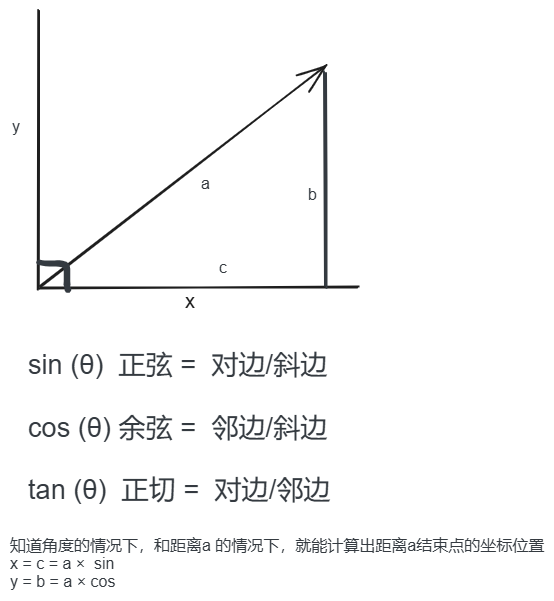

在直角三角形中，由于边和角之间的关系非常明确，我们可以直接使用三角函数（如 `cos` 或 `sin`）来计算某个边的长度或投影。然而，对于其他类型的三角形（如锐角三角形或钝角三角形），情况会变得更加复杂，因为边和角之间的关系不再像直角三角形那样简单直接。

### 1. **直角三角形的特殊情况**
在直角三角形中，三角函数可以直接应用于边和角的关系。例如：
• **邻边** = 斜边 × cos(θ)
• **对边** = 斜边 × sin(θ)

这是因为直角三角形的邻边和对边分别与斜边和角度θ形成了明确的三角函数关系。例如，如果你知道斜边长度和角度θ，你可以直接用 `cos(θ)` 或 `sin(θ)` 来计算邻边或对边的长度。

### 2. **其他三角形的情况**
对于非直角三角形（如锐角三角形或钝角三角形），边和角之间的关系不再像直角三角形那样直接。在这种情况下，我们需要更复杂的公式来计算某个边的长度或投影。

• **邻边 × cos(θ) + 对边 × sin(θ)**  
  这个公式实际上是一个通用的向量投影公式，用于计算一个向量在另一个方向上的投影长度。它不仅仅适用于直角三角形，而是适用于任意类型的三角形或向量关系。

  例如，在非直角三角形中，如果你想计算一个边在某个方向上的投影，你需要同时考虑邻边和对边的影响。这是因为非直角三角形的边和角之间的关系更加复杂，无法仅通过 `cos(θ)` 或 `sin(θ)` 单独计算。

### 3. **为什么需要邻边 × cos(θ) + 对边 × sin(θ)**
在非直角三角形中，一个边在某个方向上的投影不仅取决于邻边（即与角度θ相邻的边），还取决于对边（即与角度θ相对的边）。因此，我们需要同时使用 `cos(θ)` 和 `sin(θ)` 来计算投影：
• `邻边 × cos(θ)` 计算的是邻边在目标方向上的投影。
• `对边 × sin(θ)` 计算的是对边在目标方向上的投影。
• 将两者相加，得到边在目标方向上的总投影长度。

### 4. **总结**
• **在直角三角形中**，由于边和角之间的关系非常简单，你可以直接用 `邻边 = 斜边 × cos(θ)` 或 `对边 = 斜边 × sin(θ)` 来计算。
• **在非直角三角形中**，边和角之间的关系更加复杂，因此需要使用更通用的公式 `邻边 × cos(θ) + 对边 × sin(θ)` 来计算某个边的投影或长度。

这种区别源于直角三角形和非直角三角形在几何结构上的不同。直角三角形由于其特殊的结构，可以直接应用简单的三角函数，而非直角三角形则需要更复杂的公式来解决问题。
 