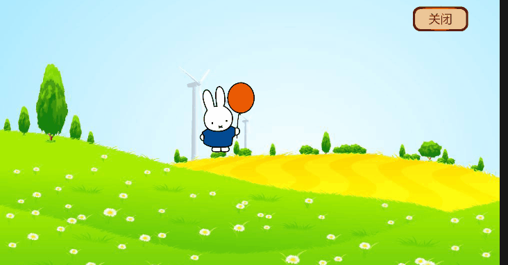

# 坐标的使用
* convertToWorldSpaceAR	本地坐标系 → 世界坐标系	世界坐标系原点	获取节点在世界中的位置
* convertToNodeSpaceAR	世界坐标系 → 本地坐标系	目标节点的本地坐标系原点	获取世界坐标在某个节点本地坐标系中的位置
```js

    //本地坐标系 → 世界坐标系
  let worldPos = this.node.parent.getComponent(UITransform).convertToWorldSpaceAR(position.toVec3());
  // 世界坐标系 → 本地坐标系
   let nodePos =  this.node.parent.getComponent(UITransform).convertToNodeSpaceAR(position.toVec3());


```

# 解决点击元素移动时，由于圆心的问题，移动位置没有跟随第一次onStart的position。

  * 问题

    

```js
    onStart(event: EventTouch) {
        this.startNodePos = this.node.getPosition();
        this.startPoint = this.node.parent.getComponent(UITransform).convertToNodeSpaceAR(event.getUILocation().toVec3());

        //计算圆心差 圆心差=圆心-起始点
        this.radiusDiff= this.startPoint.subtract(this.startNodePos);
        console.log("radiusDiff",this.radiusDiff);
    }
    onMove(event: EventTouch) {
        let position:Vec2=event.getUILocation();
        let point =  this.node.parent.getComponent(UITransform).convertToNodeSpaceAR(position.toVec3());
        //点击点-圆心差
        this.node.setPosition(point.subtract3f(Math.abs(this.radiusDiff.x),Math.abs(this.radiusDiff.y),0));
    }
   ```
